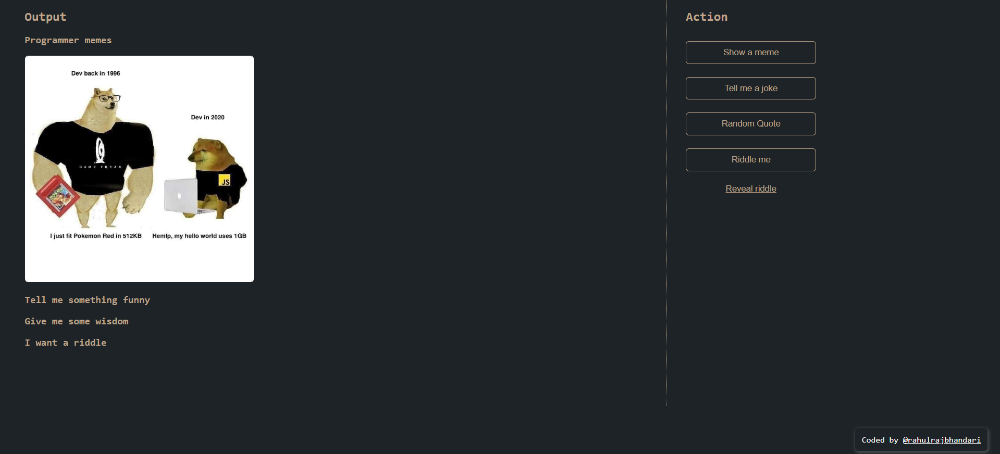

# Meme Generator

<h2 align="center">Hi 👋, I'm Rahul Rajbhandari</h2>

The name of this project is given Meme Generator, but we have 4 different generator which generates the following:

1. Memes 
2. Jokes
3. Quotes
4. Riddles

## Screenshots

## Try on :
<a href="memepasal.netlify.app"> memepasal.netlify.app </a>

## Languages Used:

    

